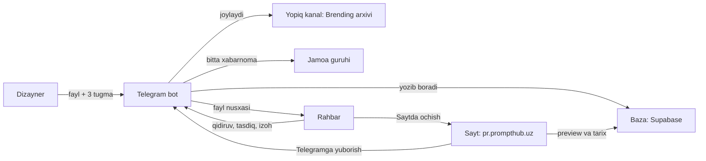

# PR Brend — Milliy PR markazi rahbariyati va branding bo'limi uchun ichki tizim

> **Sana:** 2026-09-30 · **Holat:** Konsepsiya — muhokama uchun · **Tayyorladi:** Claude Code, Sancho uchun
> Bu hujjatda kod yo'q. Maqsad — qaror qabul qilish, keyin tizimni Claude Code bilan bosqichma-bosqich qurish.
> 1–17-bo'limlarni markaz rahbari yoki branding bo'limi boshlig'iga ham ko'rsatsa bo'ladi. "Texnik ilova" — Claude Code uchun.

**Ishchi nom variantlari:**

| Variant | Izoh |
|---|---|
| **PR Brend** (tavsiya) | Qisqa va neytral. Bot nomi, masalan, `@milliypr_brend_bot` (bandligi hali tekshirilmagan). |
| Brendxona | O'zbekcha, esda qoladi ("ustaxona" kabi), lekin rasmiy muhitga biroz norasmiy. |
| Brend arxivi | Nima qilishini aniq aytadi, lekin tasdiqlash va izoh qismini aks ettirmaydi. |

---

## 1. Qisqacha

- **Nima bu:** markaz rahbari va branding bo'limi o'rtasida dizayn materiallari (taklifnomalar, bannerlar, logotiplar, prezentatsiyalar, stend va bosma maketlar) uchun yagona tartibli joy. Asosiy vosita — **Telegram bot**. Yonida kichik **sayt**: mini landing, parolsiz kirish paneli, katta preview (oldindan ko'rish) va versiyalar tarixi.
- **Fayllar qayerda:** asl fayllar yopiq Telegram kanalida ("Brending arxivi") saqlanadi. Bot faylni o'zi yetkazadi, hajmidan qat'i nazar. Fayllar sayt orqali o'tmaydi.
- **Rahbar uchun:** botga "navruz taklifnoma" deb yozadi va 2–3 bosishda yakuniy fayl chatda paydo bo'ladi. Yangi dizayn kelganda bitta tugma bilan tasdiqlaydi yoki matn yoki ovozli xabar bilan izoh qoldiradi. Parol yo'q.
- **Dizaynerlar uchun:** Figma'dan eksport qilingan faylni botga tashlaydi va 3 ta tugma bosadi. Bot versiya raqamini o'zi qo'yadi, kanalga joylaydi, rahbarga yuboradi. Jamoa guruhida "👀 Rahbar ko'rdi" va "✅ Tasdiqlandi" belgilari chiqadi.
- **"Qaysi biri oxirgisi?" savoli yo'qoladi:** tizim doim avval "Yakuniy" (tasdiqlangan) versiyani beradi. Eski versiyada ogohlantirish chiqadi, qoralamalarni forward qilib bo'lmaydi.
- **Bu nimaga yordam beradi:** yakuniy versiyaning yagona manbai bo'ladi, har bir izoh aniq versiyaga bog'lanadi, kim qachon nimani tasdiqlagani yozib boriladi. Fayllar shaxsiy chatlarda yo'qolmaydi, dizaynerlar rahbar ko'rgan-ko'rmaganini biladi.
- **Boshqa bo'limlarga:** har bir bo'lim o'z yopiq kanali, o'z jamoa guruhi va bitta sozlamalar qatoriga ega bo'ladi. Yangi bo'lim taxminan 1 kunlik sozlash, kod o'zgarmaydi. Yuridik, kadrlar va buxgalteriya bo'limlari kiritilmaydi.
- **Muddat va narx:** bot taxminan 4-haftada ishlay boshlaydi, sayt bilan to'liq birinchi versiya 6–7-haftada tayyor bo'ladi (kuniga bir necha soat ishlaganda), keyin 2 haftalik sinov (pilot). Pilot $0/oy, rasmiy foydalanish taxminan $45/oy.

---

## 2. Muammo: bugun qanday ishlaydi

Sizning tavsifingizga va shunga o'xshash jamoalar tajribasiga ko'ra, dizayn fayllari shaxsiy chatlar va umumiy guruhlar orqali yuradi. Natijada:

- **"Qaysi biri oxirgi versiya?"** — chatda `taklifnoma_final_2_new.pdf` kabi 5 ta o'xshash fayl turadi.
- **Qayta-qayta yuborish:** rahbar so'raydi, dizayner eski xabarlardan qidiradi, yana jo'natadi.
- **Izohlar yo'qoladi:** ovozli xabarlar chat oqimida ko'milib ketadi, qaysi versiyaga tegishli ekani noma'lum qoladi.
- **Tasdiqlash izsiz:** kim, qachon "bo'ldi, chiqaring" degani hech qayerda yozilmaydi.
- **Dizaynerlar noaniqlikda:** rahbar faylni ko'rdimi-yo'qmi bilmaydi, kichik xodimlar rahbarni qayta eslatishga majbur.
- **Eng xavflisi:** tasdiqlanmagan yoki eski taklifnoma vazirlik yoki hamkorlarga yuborilib ketishi.

---

## 3. Yechim: uch qism va ular qanday bog'lanadi

| Qism | Vazifasi | Kim ishlatadi |
|---|---|---|
| **Yopiq kanal "Brending arxivi"** | Asl fayllar ombori (bitta fayl 2 GB gacha). Odamlar u yerga qo'lda yozmaydi, faylni bot joylaydi. | Bot; xohlasa rahbar faqat o'qish uchun |
| **Telegram bot** | Asosiy vosita: yuklash, qidirish, fayl yetkazish, tasdiqlash, izoh, ertalabki xulosa | Rahbar, dizaynerlar, bo'lim boshlig'i |
| **Sayt `pr.prompthub.uz`** | Mini landing, parolsiz kirish, kutubxona, katta preview, versiyalar tarixi, minimal boshqaruv | Rahbar (kattaroq ko'rish uchun), dizaynerlar (kompyuterda) |
| Jamoa guruhi "Brending jamoasi" | Har bir versiya uchun bitta xabarnoma, rahbar izohlari shu xabar ostida | Branding bo'limi |
| Zaxira kanali | Har kuni ma'lumotlar nusxasi va tizim ogohlantirishlari | Adminlar |
| Baza (Supabase, Frankfurt) | Fayllar haqidagi ma'lumotlar (nomi, versiyasi, holati, izohlar) va kichik preview rasmlar. Asl fayllarning o'zi emas. | Faqat bot va sayt serveri |



**To'rtta asosiy tamoyil:**
1. **Bot birinchi, sayt ikkinchi.** Rahbarning kundalik ishi Telegram ichida bo'ladi, sayt katta ko'rinish va tarix uchun.
2. **Fayllar sayt orqali o'tmaydi.** Telegram faylni o'zi yetkazadi, shu sabab 200 MB li bosma PDF ham bir necha soniyada keladi.
3. **Dizaynerlar versiya raqami yoki hashtag yozmaydi.** Bot o'zi raqamlaydi va izohni o'zi yozadi.
4. **Bu rasmiy hujjat tizimi emas.** Xatlar, buyruqlar, shartnomalar va mehmonlar ro'yxati davlat elektron hujjat tizimlarida qoladi. Bu yerda faqat dizayn materiallari saqlanadi.

---

## 4. Sizning g'oyangiz qanday aniqlashtirildi

| Sizning g'oyangiz | Taklif | Nega |
|---|---|---|
| "prompthub domeni bilan ulangan bo'ladi" | `pr.prompthub.uz` subdomeni, lekin PromptHub'dan **alohida** loyiha (alohida kod, baza, bot) | PromptHub'ning admin himoyasi zaif. Davlat tashkilotining ma'lumotlari u bilan aralashmasligi kerak. Keyin markazning o'z domeniga ko'chirish bir necha sozlama bilan bo'ladi (Q.8), ma'lumotlar o'zgarmaydi. `prompthub.uz/pr` — faqat `pr.prompthub.uz`ga yo'naltiruvchi qisqa havola (redirect), ilova PromptHub ostida xizmat qilmaydi. |
| "fayllar hammasi Telegram kanalda turadi, unga link beriladi" | Fayllar kanalda turadi, lekin **bot faylning o'zini** rahbarning chatiga yuboradi | Yopiq kanal postiga havola (`t.me/c/...`) faqat kanal a'zolariga ochiladi, uni qidirish ham qiyin. Rahbar xohlasa, kanalga faqat o'qish uchun qo'shilishi mumkin. |
| "yoki Figma fayl link bersak bo'ladi" | Figma — dizaynerlar uchun ikkinchi darajali "manbani ochish" tugmasi. Rahbar bizning PNG preview'larimizni ko'radi. | Rahbar telefonida Figma'ga kirmagan bo'ladi, shuning uchun kirish oynasi chiqadi. "Havolasi borlar ko'ra oladi" rejimi esa chiqmagan taklifnomalarni tashqariga oshkor qiladi. |
| "mini landing page va kirish paneli" | Landing + parolsiz kirish: telefonda bot tugmasi, kompyuterda QR-kod | Rahbar parol eslab qolishi shart emas. Kirish Telegram hisobiga bog'lanadi. |
| "botda fayllarni qidirib olishi mumkin bo'ladi" | Botga yozilgan istalgan matn qidiruv hisoblanadi: lotin, kirill va rus tilida | Buyruq sintaksisini eslab qolish kerak emas. |
| "sayt orqali preview, taklifnomalar oxirgi versiyasi" | Har bir ish uchun katta preview, versiyalar tarixi va aniq "Yakuniy / Eng yangi" qoidasi | "Oxirgi" har doim ham "tasdiqlangan" degani emas. Tizim bu ikkisini ajratib ko'rsatadi. |
| "boshqa bo'limlar uchun kengaytiramiz" | Har bo'limga alohida kanal va guruh, sozlama orqali qo'shiladi | Telegram mavzularini (topic) a'zolarga qarab yopib bo'lmaydi, alohida kanal esa haqiqiy ajratishni beradi. |

---

## 5. Sizdan kerak bo'lgan 6 ta qaror

Har birida tavsiya etilgan variant bor. "Ha" desangiz, shu variant qabul qilinadi.

1. **Bu pullik yoki rasmiy ishmi, yoki bepul pilotmi? Markazda kim yozma rozilik beradi (axborot xavfsizligi mas'uli, yurist)?**
   *Tavsiya:* 1 oylik bepul pilot, faqat maxfiy bo'lmagan branding materiallari bilan, Vercel Hobby va Supabase Free'da. Branding boshlig'i 0-bosqichda yozma rozilik so'raydi. Pul yoki rasmiy foydalanish boshlangan kuni Vercel Pro'ga ($20/oy) o'tiladi, ishlab chiqarishda Supabase Pro ham ($25/oy) qo'shiladi. Shartnoma bo'lsa, kod va akkauntlar kimga tegishli ekanini oldindan kelishib oling.
2. **Bot va kanallar kimning Telegram akkauntiga tegishli bo'ladi? Botning doimiy nomi qanday?**
   *Tavsiya:* markazning ish akkaunti (ikki bosqichli tekshiruv yoqilgan) bot, "Brending arxivi", jamoa guruhi va "Zaxira" kanalini yaratadi. Siz ikkinchi admin va dasturchi sifatida bo'lasiz. Bot nomi `@milliypr_brend_bot` kabi bo'ladi va **umrbod o'zgarmaydi**, chunki saqlangan fayl havolalari shu botga bog'langan.
3. **Domen va brend: pilot `pr.prompthub.uz`dami yoki markazning o'z subdomenidami? Landing va botda markaz nomi va logotipi ko'rsatilsinmi?**
   *Tavsiya:* pilot `pr.prompthub.uz`da, neytral nom ("PR Brend") bilan, PromptHub brendingisiz. Markaz logotipi faqat yozma ruxsat bilan qo'yiladi. Tizim rasmiylashganda markaz domeniga (masalan, `brend.nationalprcenter.uz`) ko'chiriladi. Bunda domen va bir necha sozlama o'zgaradi (Ilova Q.8), ma'lumotlar o'zgarmaydi.
4. **Kim tasdiqlaydi va rahbarning Telegram'idan amalda kim foydalanadi?**
   *Tavsiya:* branding uchun yagona tasdiqlovchi — rahbar. Keyinchalik o'rinbosarga ham tasdiqlash huquqi berilishi mumkin. Agar rahbarning telefonini yordamchi yuritsa, yordamchi hamma narsani ko'radi, lekin tasdiqlay olmaydi.
5. **Branding fayllari hozir Telegram kanal yoki guruhda turibdimi? Taxminan nechta? "Restrict saving content" (saqlashni cheklash) yoqilganmi?**
   *Tavsiya:* bot birinchi postdan boshlab admin bo'lgan yangi arxiv kanali ochiladi. Eski fayllardan faqat rahbar eng ko'p so'raydigan ~20 tasi va joriy loyihalar forward qilib import qilinadi. Qolganlari qidiruvda kerak bo'lib qolgandagina qo'shiladi.
6. **Qoralama va izohlar siyosati qanday bo'ladi?**
   *Tavsiya:* qoralamalar rahbarga forward va saqlashdan himoyalangan holda keladi. Yuqori rahbariyatga ko'rsatish kerak bo'lsa, rahbar "🔓 Himoyasiz nusxa" tugmasini bosadi va bu jurnalga yoziladi. Tasdiqlangan yakuniy fayllarni erkin forward qilish mumkin. Rahbar izohlari, jumladan ovozli xabarlar, butun branding jamoasiga shu versiya ostida ko'rinadi. Muqobil variant: faqat dizayner va bo'lim boshlig'iga ko'rinadi.

---

## 6. Kundalik stsenariylar

### 6.1. Rahbar yakuniy taklifnomani oladi (3 bosish, 10 soniyadan kam)

```
Rahbar:  navruz taklifnoma
Bot:     "navruz taklifnoma" bo'yicha 3 ta natija:
         [📄 Navro'z 2027 · Taklifnoma (UZ) · v5 ✅]
         [📄 Navro'z 2027 · Taklifnoma (RU) · v2 ✅]
         [📄 Navro'z 2027 · VIP taklifnoma · v1 ⏳]
Rahbar:  (birinchi tugmani bosadi)
Bot:     [PDF, 38 MB] [PNG]
         ✅ Yakuniy versiya · Navro'z 2027 · Taklifnoma (UZ) · v5
         Tasdiqlangan: 28.09.2026 16:40 · Dizayner: Aziza
         [📂 Versiyalar] [🌐 Saytda ochish]
```

Fayl tasdiqlangan, shuning uchun rahbar uni istalgan joyga forward qila oladi. Faqat bitta aniq natija bo'lsa, bot ro'yxatsiz darhol faylni yuboradi. "навруз таклифнома" yoki "приглашение навруз" yozilsa ham shu natija chiqadi.

### 6.2. Dizayner yangi versiyani yuklaydi

```
Dizayner: (taklifnoma_uz.pdf va taklifnoma_uz.png ni "Fayl" sifatida botga tashlaydi)
Bot:      📥 2 ta fayl qabul qilindi (PDF, PNG). Qaysi ishga tegishli?
          [🔁 Yana shu: Navro'z 2027 · Taklifnoma (UZ) → v3]
          [📁 Boshqa ish] [➕ Yangi ish]
Dizayner: 🔁 Yana shu
Bot:      v2 dagi izoh: "Sanani 21-mart qiling, logotip kichik". Bajarildimi?
          [✅ Ha, hammasi] [Qisman] [Yo'q]
Dizayner: ✅ Ha, hammasi
Bot:      Nima o'zgardi? Qisqa yozing — rahbar shuni ko'radi.   [O'tkazib yuborish]
Dizayner: Sana tuzatildi, logotip 20% kattalashtirildi
Bot:      Kimga yuboramiz?  [👀 Rahbarga] [🗂 Faqat arxivga]
Dizayner: 👀 Rahbarga
Bot:      Tayyor ✅ v3 kanalga joylandi va rahbarga yuborildi. Javob kelishi bilan xabar beraman.
```

Shu paytda jamoa guruhida bitta xabar paydo bo'ladi: `📤 Navro'z 2027 · Taklifnoma (UZ) · v3 — Aziza · ⏳ Kutilmoqda`.
"➕ Yangi ish" tanlansa, bot turini (taklifnoma, banner...), loyihasini (oxirgi 5 ta loyiha yoki yangisi) va nomini so'raydi. Hammasi tugma bilan, faqat nom yoziladi.

### 6.3. Rahbar ovozli izoh qoldiradi, keyin tasdiqlaydi

```
Bot → Rahbar:  [katta preview rasm]
               🆕 Ko'rib chiqish uchun
               Navro'z 2027 · Taklifnoma (UZ) · v3
               Dizayner: Aziza · bugun 14:05
               Nima o'zgardi: Sana tuzatildi, logotip 20% kattalashtirildi
               ☑️ Oldingi izohingiz bajarildi: "Sanani 21-mart qiling, logotip kichik"
               [✅ Tasdiqlash] [✏️ O'zgartirish kerak]
               [📄 Fayllar] [📂 Versiyalar] [🌐 Saytda ochish]
Rahbar:        (kartaga "Javob berish" orqali 12 soniyalik ovozli xabar:
                "Yaxshi, faqat fonni biroz ochroq qiling")
Bot:           Izohingiz dizaynerlarga yetkazildi ✅ Bu versiya bo'yicha qaror?
               [✏️ Qayta ishlansin] [✅ Izoh bilan tasdiqlash] [⏳ Keyinroq]
Rahbar:        ✏️ Qayta ishlansin
```

**Jamoa guruhida** o'sha bitta xabar joyida o'zgaradi: `⏳ Kutilmoqda` → `👀 Rahbar ko'rdi 14:20` → `✏️ Izoh bor`. Ovozli xabar shu xabarga javob sifatida chiqadi.
16:30 da Aziza "🔁 Yana shu" bilan v4 ni yuklaydi va izohni "bajarildi" deb belgilaydi. Rahbarning yangi kartasida `☑️ Oldingi izohingiz bajarildi: 🎙 ovozli izoh (14:20)` yoziladi. Rahbar ✅ bosadi. Shundan so'ng:
- rahbar kartasidagi tugmalar `✅ Tasdiqlandi · 16:40` yozuviga almashadi;
- guruhdagi xabar `✅ Tasdiqlandi 16:40` bo'ladi;
- Aziza shaxsiy xabar oladi: "Tasdiqlandi! v4 — endi bosmaga yuborishingiz mumkin";
- kanaldagi v1–v3 postlari izohiga `🗄 ESKIRGAN → v4` belgisi qo'shiladi.

Muhim aniqlik: Telegram bot xabar qachon *o'qilganini* bila olmaydi. "Rahbar ko'rdi" belgisi rahbar kartadagi biror tugmani bosganda, faylni olganda yoki saytda ochganda qo'yiladi.

### 6.4. Saytda ishlash

- **Telefonda:** rahbar botdagi "🌐 Saytda ochish" tugmasini bosadi va sayt parolsiz, kirilgan holda ochiladi. Bu Telegram imzolab beradigan kirish tugmasi, texnik nomi login_url.
- **Kompyuterda:** `pr.prompthub.uz` → "Telegram orqali kirish" → ekranda QR-kod. Telefon kamerasi bilan skanerlanadi, bot so'raydi: "Kompyuterda kirishni tasdiqlaysizmi? (Chrome · Windows · 14:05)" → [✅ Ha, men] → kompyuterdagi sahifa o'zi ochiladi.
- **Kutubxona (`/ishlar`):** qidiruv maydoni va filtrlar (tur, loyiha, holat). "⏳ Kutilmoqda" filtri rahbar hali javob bermagan ishlarni ko'rsatadi.
- **Ish sahifasi (`/ish/K27`):** katta preview, "Yakuniy v4 · Eng yangi v5 ko'rib chiqishda" belgilari, v1…v5 tarixi, har bir versiyadagi izohlar va qarorlar. Tugmalar: "Telegramga yuborish" (bot asl faylni chatingizga tashlaydi), "Tasdiqlash / O'zgartirish kerak" (rahbarga), "Figma'da ochish" (branding xodimlariga).

---

## 7. "Oxirgi versiya" qoidasi

Har bir ishning ikki ko'rsatkichi bor. **Yakuniy** — eng yuqori raqamli tasdiqlangan versiya (tasdiq talab qilinmaydigan turlarda va eski importlarda "tayyor" versiya). **Eng yangi** — arxivlanmagan eng oxirgi versiya. Qidiruv va yetkazish odatda **Yakuniy**ni beradi. Undan yangi versiya ko'rib chiqilayotgan bo'lsa, yonida `🆕 v5 ko'rib chiqishda` belgisi chiqadi. Hali hech narsa tasdiqlanmagan bo'lsa, eng yangi versiya `⚠️ Qoralama — tashqariga yubormang` yozuvi bilan va forward'dan himoyalangan holda keladi. Eski versiya ochilsa yoki yuborilsa, ustida `⚠️ Bu eski versiya (v3). Oxirgisi: v5` yozuvi va tugma chiqadi. Eski versiyani tasdiqlashdan oldin bot "Yangiroq v5 bor. Baribir v4 ni tasdiqlaysizmi?" deb so'raydi. Yangi versiya tasdiqlanganda eskilari "eskirgan" bo'ladi va kanaldagi postlariga `🗄 ESKIRGAN → v5` qo'shiladi. Hech narsa o'chirilmaydi: noto'g'ri yuklangan versiya "🗄 Arxivga" tugmasi bilan yashiriladi va oldingisi yana "oxirgi" bo'ladi.

| Belgi | Ma'nosi |
|---|---|
| ✅ Yakuniy · v5 | Tasdiqlangan, forward qilish mumkin |
| ⏳ Ko'rib chiqishda | Rahbar javobini kutmoqda, himoyalangan |
| ✏️ O'zgartirish kerak | Rahbar izoh qoldirgan, dizayner qayta ishlaydi |
| 📝 Qoralama | Faqat arxivga joylangan, rahbarga yuborilmagan |
| ✔️ Tayyor | Tasdiq talab qilinmaydigan tur yoki eski import |
| 🗄 Eskirgan | Yangiroq versiya tasdiqlangan |

---

## 8. Fayl joylash qoidasi (dizaynerlar uchun bir sahifa)

Bu sahifa jamoa guruhida mahkamlab qo'yiladi va botda `/yordam` orqali ko'rinadi.

1. **Har bir tayyor ishni botga tashlang:** PNG va bosma uchun PDF. Rahbarga shaxsiy chatda fayl yubormang.
2. **Yakuniy fayllarni "Fayl" sifatida yuboring, "Rasm" sifatida emas.** Rasm sifatida yuborilgan fayl taxminan 2560 px gacha siqiladi, sifat pasayadi. Bot buni sezsa, ogohlantiradi.
3. **Katta PDF, AI, ZIP yoki video bo'lsa, yoniga PNG ham qo'shing** (bitta yuborishda). PNG preview uchun kerak.
4. **Versiya raqami, hashtag va fayl nomi haqida o'ylamang.** Bot hammasini o'zi qo'yadi.
5. **Kanalda hech narsani o'chirmang.** Botda yoki saytda "🗄 Arxivga" bosing. Bot kanaldagi o'chirishni ko'rmaydi, shuning uchun o'chirilgan post tizimda "arvoh" bo'lib qoladi.
6. **Davlat siri, "xizmat doirasida foydalanish uchun" hujjatlar va mehmonlar ro'yxati bu yerga yuklanmaydi.** Taklifnomaning shablonini saqlang, ism-familiyali nusxalarini emas.
7. **Figma faylini "Anyone with the link" (havolasi borlar ko'ra oladi) qilmang.**

**Bot kanalga yozadigan izoh (caption) formati:** 1-qator nom, 2-qator "Loyiha · Tur · vN · holat", 3-qator hashtaglar va ish kodi. Figma havolasi kanalga yozilmaydi.

```
Navro'z-2027 qabul marosimi taklifnomasi (UZ)
Navro'z 2027 · Taklifnoma · v3 · ⏳ Ko'rib chiqishda
#taklifnoma #navruz2027 #K27
```
```
ITB Berlin 2027 stend — asosiy devor
ITB 2027 · Stend · v5 · ✅ Tasdiqlangan
#stend #itb2027 #K41
```
```
🗄 ESKIRGAN → v5
Markaz logotipi — to'liq paket (PNG, SVG, PDF)
Brend to'plami · Logo · v1 · Eskirgan
#logo #brend #K3
```

- **Tur tegi** (branding boshlig'i bilan tasdiqlanadi): `#taklifnoma #banner #logo #prezentatsiya #smm #bosma #stend #video #boshqa`.
- **Loyiha tegi:** kichik lotin harflari va raqamlar, apostrofsiz (`#navruz2027`, `#itb2027`). Telegram hashtag havolasi apostrofda uziladi.
- **Ish kodi** (`#K27`): kanalda shu tegni bossangiz, o'sha ishning barcha versiyalari Telegram'ning o'zida chiqadi. Sayt ishlamay qolsa ham arxivni ko'rib chiqish mumkin.
- **Kanalga to'g'ridan-to'g'ri joylash** (faqat post huquqi borlar uchun, kamdan-kam holatda): oldingi versiya postiga **"Javob berish" (reply)** qilib joylang, yoki izohga `#K27` yozing. Aks holda fayl "Saralanmagan" ro'yxatiga tushadi va bot bo'lim boshlig'idan "Bu fayl qaysi ishga?" deb so'raydi. Tizim hech narsani taxmin qilmaydi.

---

## 9. Bot

### 9.1. Tugmalar va buyruqlar

Pastki doimiy tugmalar: **[🔎 Qidirish] [🆕 Yangilar] [⏳ Kutilmoqda] [🌐 Sayt]**. Dizaynerlarda qo'shimcha **[📤 Yuklash]** bor. Telegram buyruq nomlari faqat lotin kichik harflarida bo'ladi, izohlari o'zbekcha.

| Buyruq | Kim uchun | Nima qiladi |
|---|---|---|
| `/start` | hamma | Taklif havolasi orqali kirish, salomlashish, tugmalar |
| `/qidir <so'z>` | hamma | Qidiruv (oddiy matn yozish ham qidiruv) |
| `/yangi` | hamma | So'nggi 14 kundagi 10 ta yangi ish |
| `/kutilmoqda` | rahbar, dizayner | Rahbar: javob kutayotgan ishlar. Dizayner: o'z ishlarining holati |
| `/sayt` | hamma | Saytga kirilgan holda o'tish tugmasi |
| `/yordam` | hamma | Rolga mos qisqa qo'llanma |
| `/bekor` | hamma | Ochiq yuklash yoki izoh jarayonini bekor qilish |
| `/taklif` | admin | Yangi xodim uchun bir martalik taklif havolasi va QR |
| `/azolar` | admin | A'zolar ro'yxati, rol o'zgartirish, chiqarish |
| `/import` | admin, bo'lim boshlig'i | 60 daqiqalik eski fayllarni import qilish rejimi |
| `/holat` | admin | Tizim holati: webhook, zaxira, saralanmagan, buzilgan fayllar |

### 9.2. Qidiruv

- Botga yozilgan **istalgan matn** qidiruv hisoblanadi: lotin (`navruz taklifnoma`), kirill (`таклифнома`) yoki rus tilida (`приглашение`). Tutuq belgisi farqlari (`navro'z`, `navroʻz`, `navroz`) ham bir xil qabul qilinadi.
- **1 ta aniq natija** bo'lsa, fayl darhol keladi. **2–8 natija** bo'lsa, tugmalar ro'yxati va sahifalash chiqadi. **Natija yo'q** bo'lsa, bot "Hech narsa topilmadi. Masalan: *itb stend* yoki *logo png*" deb javob beradi.
- Natija topilmagan har bir qidiruv jurnalga yoziladi. Bo'lim boshlig'i haftada bir marta 10 daqiqa shu ro'yxatni ko'rib, yangi sinonim qo'shadi yoki yetishmayotgan faylni import qiladi.

### 9.3. Fayl yetkazish va himoya

- Bot faylni kanaldan nusxalab yuboradi. Hajm cheklovi yo'q, fayl bir necha soniyada keladi.
- **Qoralama, ko'rib chiqilayotgan va "o'zgartirish kerak" versiyalar** himoyalangan holda yuboriladi. Texnik nomi `protect_content`: forward qilish va saqlashni taqiqlovchi Telegram belgisi.
- **Tasdiqlangan va tayyor** fayllar himoyasiz yuboriladi, chunki rahbarning asosiy ishi yakuniy taklifnomani tashqariga jo'natish.
- Yuborish muvaffaqiyatsiz bo'lsa (masalan, kimdir postni kanaldan o'chirgan bo'lsa), bot zaxira usulni sinaydi. Bu ham ishlamasa, faylni "buzilgan" deb belgilaydi, bo'lim boshlig'iga xabar beradi va oldingi yaroqli versiyani taklif qiladi.

### 9.4. Xabarnomalar

- **Rahbarga:** har bir "Rahbarga" versiya uchun bitta karta (albom ham bitta karta). Ertalab 08:00–09:00 oralig'ida qisqa xulosa, lekin faqat kutayotgan ish bo'lsa:
  ```
  ☀️ Xayrli tong!
  ⏳ Javobingiz kutilmoqda: 3 ta ish
  • Navro'z 2027 · Taklifnoma (RU) · v2 — 1 kundan beri
  • ITB 2027 · Banner · v1 — bugun
  [👀 Ko'rib chiqishni boshlash]
  ```
- **Tungi vaqt (21:00–08:00) va dam olish kunlari:** kartalar ovozsiz keladi, lekin kechiktirilmaydi.
- **Jamoa guruhiga:** har versiyaga bitta xabar, u joyida tahrirlanadi, yangi xabarlar bilan chat to'ldirilmaydi.
- **Dizaynerga:** har bir qaror bo'yicha shaxsiy xabar.
- **Adminlarga:** tizim ogohlantirishlari (bot kanal adminligidan olingan, webhook xatosi, buzilgan fayl, zaxira muvaffaqiyatsiz).
- Qo'shimcha eslatmalar yubormaydi, kichik xodimlar rahbarni bezovta qilishi shart emas: ertalabki xulosa bu vazifani betaraf bajaradi.

---

## 10. Sayt

Dizayn PromptHub'ning vizual uslubiga yaqin: mobil birinchi, qorong'i va yorug' rejim. Lekin PromptHub brendingisiz. Barcha sahifalar qidiruv tizimlaridan yopiq (noindex, sitemap yo'q).

| Sahifa | Maqsad | Asosiy elementlar |
|---|---|---|
| `/` | Mini landing | "Brend materiallari — bitta joyda, doim oxirgi versiyasi". 3 qadam: *Dizayner yuklaydi → Rahbar ko'radi va tasdiqlaydi → Hamma yakuniy versiyani oladi*. "Telegram orqali kirish" va "Botni ochish" tugmalari. Hech qanday ichki fayl yoki raqam ko'rsatilmaydi. |
| `/kirish` | Kirish paneli | QR-kod va "Telefonda ochish" havolasi (3 daqiqa amal qiladi, teskari sanoq bilan). Telefondagilar uchun maslahat: "Botda /sayt deb yozing". Xato holatlari: "Ruxsat yo'q — administratorga murojaat qiling", "Havola eskirgan". Parol maydoni yo'q. |
| `/ishlar` | Kutubxona | Qidiruv (3 yozuvda), filtr tugmalari: tur, loyiha, holat (Yakuniy, Kutilmoqda, O'zgartirish kerak). Kartochkalar setkasi: preview, nom, "v4 · 28.09", holat belgisi. Loyiha filtri loyiha sahifasi vazifasini bajaradi. |
| `/ish/[kod]` | Ish sahifasi | Katta preview (qoralamada "QORALAMA · v5" lentasi), "Yakuniy / Eng yangi" belgilari. Versiyalar tarixi: kim yukladi, qachon, "Nima o'zgardi", izohlar (ovozli izoh "🎙 Ovozli izoh 0:12 — Telegramda tinglash"), qarorlar, kim ko'rdi. Tugmalar: "Telegramga yuborish", "Tasdiqlash / O'zgartirish kerak" (rahbarga), "Figma'da ochish" (branding rollariga), "Arxivga" (bo'lim boshlig'i, admin). |
| `/boshqaruv` | Minimal boshqaruv (admin, bo'lim boshlig'i) | A'zolar va taklif havolalari (QR bilan), chiqarish tugmasi. "Saralanmagan" fayllar. Natijasiz qidiruvlar va sinonim qo'shish. Tizim holati: webhook, oxirgi zaxira, cron. Faqat o'qiladigan jurnal. |
| `/maxfiylik` | Ma'lumotlar haqida qisqa bildirishnoma | Nima saqlanadi (Telegram ID, ism, rol, bo'lim, harakatlar jurnali; telefon raqami yo'q), nima uchun, qayerda (Supabase, Frankfurt va Telegram), kimga murojaat qilish. |

Keyinroq, pilot talab qilsa: versiyalarni yonma-yon solishtirish, loyihalar sahifasi va tayyorlik hisoblagichi, brend to'plami sahifasi, Telegram ichida ochiladigan Mini App.

---

## 11. Figma bilan ishlash

- Figma dizaynerlarning ustaxonasi, rahbarning ko'rish oynasi emas. Rahbar bizning PNG/WebP preview'larimizni ko'radi.
- Har bir ishda bitta Figma havolasi saqlanadi (xohlasangiz, versiyaga alohida havola ham). Dizayner havolani yuklash paytida yoki istalgan vaqtda botga tashlaydi, bot "Qaysi ishga?" deb so'raydi. `/file/`, `/design/`, `/proto/`, `/board/` havolalari qabul qilinadi.
- **Faqat Figma havolasi versiya hisoblanmaydi.** Bot javob beradi: "Figma havolasi saqlandi ✅ Rahbar ko'rishi uchun PNG (bosma uchun PDF) ham yuboring."
- "🎨 Figma'da ochish" tugmasi branding rollariga ko'rinadi, rahbarga esa faqat o'zi xohlasa.
- Ruxsatsiz joylashtirish (iframe) yo'q: Telegram ichida Figma kirish oynasi chiqadi. Figma fayllari "faqat taklif qilinganlar" rejimida qoladi.
- **Bir martalik odat:** Figma'da har bir tayyor freymga ikkita eksport sozlamasi qo'yiladi, "PNG @2x" va "PDF". Keyin: freymni tanlash → Export → ikkala faylni botga sudrash. Bor-yo'g'i shu.
- Figma'dan avtomatik preview (API orqali) faqat 5-bosqichdan keyin mumkin, u ham jamoa pullik Figma rejasida bo'lsa. Bepul rejada API oyiga bir necha so'rov bilan cheklangan, token esa 90 kunda eskiradi.

---

## 12. Kirish va xavfsizlik

**Kirish.** Parol, email yoki alohida hisob yo'q. Shaxs — Telegram hisobining raqamli ID'si, u ruxsat berilganlar ro'yxatida bo'lishi kerak. Telefonda kirish botdagi "🌐 Saytda ochish" tugmasi orqali bo'ladi, kompyuterda QR-kod va bot tasdig'i orqali. Sessiya rahbar uchun 30 kun, boshqalar uchun 14 kun faol turadi (foydalanilmasa tugaydi), istalgan payt bekor qilinishi mumkin.

**Kim nimani ko'radi:**

| Rol | Kim | Ko'radi | Qila oladi |
|---|---|---|---|
| admin | Siz va branding boshlig'i | Hammasini | A'zolar, sozlamalar, jurnal, tizim holati |
| rahbar | Markaz rahbari (keyin o'rinbosar) | Barcha bo'limlarni, qoralamalarni ham | Tasdiqlash, izoh, himoyasiz nusxa so'rash |
| bolim_boshligi | Branding bo'limi boshlig'i | O'z bo'limini to'liq | Yuklash, arxivlash, saralash, dizaynerlarni taklif qilish |
| dizayner | Branding xodimlari | O'z bo'limi, qoralamalar bilan | Yuklash, izohlarga javob (yangi versiya bilan) |
| kuzatuvchi | Keyinroq boshqa bo'limlar | Faqat "hamma"ga ochiq Yakuniy versiyalar | Qidirish va olish |

Har bir ishning ko'rinish darajasi bor: **bo'lim** (standart), **hamma** (masalan, logotip paketi) va **rahbariyat** (faqat rahbar, admin, bo'lim boshlig'i va yuklagan dizayner). Tasdiqlash huquqi alohida belgi bilan beriladi (masalan, o'rinbosarga).

**Qo'shish va chiqarish.**
- Admin `/taklif` bilan bir martalik havola yaratadi: 72 soat amal qiladi, bitta odam uchun, rol va bo'lim bilan birga. QR-kod sifatida ham chiqadi, rahbarni yuzma-yuz ulash uchun qulay.
- Havola bosilganda bot qisqa ma'lumot bildirishnomasini ko'rsatadi, **[Roziman]** bosiladi. Keyin Telegram'da ikki bosqichli tekshiruvni yoqish tavsiya qilinadi (majburiy emas).
- Ro'yxatda yo'q odam bitta muloyim javob oladi: "Bu bot ichki foydalanish uchun...". Adminlarga "[➕ Taklif qilish]" tugmali qisqa xabar boradi.
- **Chiqarish:** `/azolar` → "O'chirish". Sessiyalar va havolalar bekor qilinadi, bot odamni kanal va jamoa guruhidan chiqaradi. Adminga natija ro'yxati qaytadi: sessiya ✅, guruh ✅, kanal ✅.
- Har oyning 1-sanasida adminlarga a'zolar ro'yxati keladi, har bir odam yonida [Qoladi] / [O'chirish] tugmalari bo'ladi.

**Himoya.** Qoralamalar forward'dan himoyalangan. Hamma chatlarda ishlaydigan "inline" qidiruv rejimi o'chirilgan. Preview'lar saytda faqat 10 daqiqalik havolalar orqali ochiladi. Figma havolalari yopiq. Sayt qidiruv tizimlariga ko'rinmaydi.

**Jurnal (audit).** Kim kirdi, kim qaysi versiyani ko'rdi va oldi, kim tasdiqladi yoki izoh qoldirdi, kim qo'shildi va chiqarildi — hammasi faqat qo'shiladigan jurnalga yoziladi, uni hatto tizimning o'zi ham tahrirlay olmaydi. Shu jurnal "👀 Rahbar ko'rdi" belgisini va "rahbar qaysi versiyani olgan edi?" savoliga javobni beradi.

**Zaxira va uzluksizlik.** Bot va kanallar markazning ish akkauntidan yaratiladi, har bir platformada kamida ikki admin bo'ladi. Maxfiy kalitlar faqat Vercel sozlamalarida va markazning parol menejerida saqlanadi. Har kuni barcha ma'lumotlar nusxasi yopiq "Zaxira" kanaliga yuboriladi, tiklash bir marta sinab ko'riladi. Telegram vaqtincha ishlamasa, sayt preview, ma'lumot va tarixni ko'rsataveradi. Asl fayllar Figma'da va dizaynerlarning kompyuterida ham qoladi.

**Huquqiy masalalar (xulosa, yurist tasdig'i kerak).**
- Minimal shaxsiy ma'lumot saqlanadi: Telegram ID, ism, username, rol, bo'lim. Telefon raqami saqlanmaydi.
- Baza Yevropa Ittifoqida (Frankfurt) joylashadi. 2026-yil 27-martdan kuchga kirgan O'RQ-1125-son qonun bilan ma'lumotlarni lokalizatsiya qilish talabi yumshatilgan: endi faqat biometrik, genetik va telekom abonent ma'lumotlari O'zbekistonda saqlanishi shart. Qonunning to'liq matni tekshirilmagan.
- Markaz yuristi va axborot xavfsizligi mas'ulining **yozma roziligi** haqiqiy materiallar yuklanishidan oldin olinadi. Ma'lumotlar bazasini davlat reyestrida (pd.gov.uz) ro'yxatdan o'tkazish kerakmi, degan savol ham shu yerda hal qilinadi.
- Pullik ish bo'lsa, Vercel Pro majburiy, shartnoma esa davlat xaridlari (xarid.uzex.uz) orqali o'tishi mumkin.

---

## 13. Bu nimaga yordam beradi

- **Yagona haqiqat manbai:** "yakuniy" versiya bitta va hammaga bir xil ko'rinadi. Noto'g'ri fayl tashqariga chiqish ehtimoli keskin kamayadi.
- **Tezlik:** rahbar faylni o'zi, xodimni bezovta qilmasdan 10–15 soniyada topadi.
- **Aniq izohlar:** har bir izoh (ovozli ham) aniq versiyaga bog'langan. Keyingi versiyada "bajarildi" belgisi chiqadi, rahbar farqni qidirib o'tirmaydi.
- **Shaffoflik:** dizaynerlar rahbar ko'rgan-ko'rmaganini va qarorini darhol biladi.
- **Iz qoladi:** kim, qachon, qaysi versiyani tasdiqlagani oylar o'tib ham topiladi. Bu rahbarni ham, dizaynerni ham himoya qiladi.
- **Kengayadi:** xuddi shu tartib ko'rgazmalar, SMM, foto-video bo'limlariga sozlash orqali o'tkaziladi.

**Pilotda o'lchanadigan ko'rsatkichlar** (faqat jamoa darajasida, alohida dizaynerlar reyting qilinmaydi):

| Ko'rsatkich | Maqsad (2 haftalik pilot) |
|---|---|
| Faylni topish vaqti (eng ko'p so'raladigan 20 tadan tasodifiy 10 tasi) | Har biri ≤ 15 soniya |
| Bot orqali qilingan tasdiqlar ulushi | ≥ 80% |
| Qarorgacha o'rtacha vaqt ("Rahbarga" → qaror) | < 1 ish kuni |
| "Noto'g'ri yoki eski fayl yuborildi" holatlari | 0 |
| Rahbarning qidiruvlari soni | ≥ 10 |
| Natijasiz qidiruvlar | Haftadan haftaga kamayadi |

---

## 14. Boshqa bo'limlarga kengaytirish

**Oddiy qilib aytganda:** bo'lim — bu bazadagi bitta qator: nomi, yopiq arxiv kanali, jamoa guruhi, fayl turlari ro'yxati, tasdiqlovchisi va standart ko'rinish darajasi. Bot yangi kanalga admin qilib qo'shilsa, adminlardan "Qaysi bo'limga biriktiramiz?" deb so'raydi. Ro'yxatga olinmagan chatdan bot o'zi chiqib ketadi. Har bir bo'limga alohida kanal kerak, chunki Telegram guruhidagi mavzular (topic) hammaga ko'rinadi, ularni yopib bo'lmaydi.

**Qoidalar:**
- O'z bo'limingizdan tashqarida faqat "hamma"ga ochiq **Yakuniy** versiyalarni ko'rasiz. Rahbar hammasini ko'radi.
- **Loyihalar va tadbirlar bo'limlararo** bo'ladi: "ITB 2027" ichida stend (ko'rgazmalar), taklifnoma (branding), video (foto-video) va press-reliz (matbuot) birga turadi. Rahbar tadbirlar bilan fikrlaydi, "itb" deb yozsa hammasi chiqadi.
- **Qabul qilish qoidasi:** bo'limning mahsuloti boshqalar *topishi va olishi* kerak bo'lgan fayllar bo'lishi, tasdiqlovchisi bo'lishi va rasmiy hujjat, davlat siri yoki shaxsiy ma'lumot bo'lmasligi kerak.
- **Tartib:** bir vaqtda bitta bo'lim qo'shiladi, branding kamida 1 oy barqaror ishlagandan keyin (tasdiqlarning ≥80% i botda bo'lsa).

| Bo'lim | Nimani saqlaydi | Qo'shimcha nima kerak | Taxminiy mehnat |
|---|---|---|---|
| Branding (pilot) | Taklifnoma, banner, logo, prezentatsiya, stend dizayni, bosma maketlar | Asosiy tizim | 1–4-bosqichlar |
| Ko'rgazmalar va tadbirlar (ITB, WTM, FITUR, Toshkent yarmarkasi) | Stend loyihalari, joylashuv sxemalari, tadbir dasturlari, foto hisobotlar | Loyihaga tadbir sanasi, loyiha sahifasi | ~1 kun sozlash + 1–2 kun loyiha sahifasi |
| SMM | Post, karusel, stories maketlari, oylik kontent-reja | Kundalik postlar uchun "tasdiq shart emas" turi | ~1 kun |
| Foto-video | Suratlar to'plami (albom), 2 GB gacha video | Muqova rasm preview sifatida, faqat bot orqali yetkazish | ~1–2 kun |
| Monitoring va tahlil | Haftalik media monitoring, KPI hisobotlari (PDF) | `/hisobot` — har turdagi oxirgi hisobot bir bosishda | ~1–2 kun |
| Nashriyot | Buklet, xarita, jurnal: bosma PDF + veb versiya | Hozirgi "PNG + PDF" qoidasi yetarli | ~1 kun |
| Matbuot xizmati | Press-relizlar (DOCX/PDF), media-kit | Til variantlarini (uz/ru/en) bog'lash, keyinroq hujjat ichida qidiruv | ~2–3 kun |
| Yuridik, kadrlar, buxgalteriya | — | **Tavsiya etilmaydi**: shartnomalar, buyruqlar va shaxsiy ma'lumotlar davlat e-hujjat tizimida qoladi | — |

**Erta umumlashtirmaslik kerak bo'lgan narsalar:** ixtiyoriy maydonlar konstruktori, sozlanadigan tasdiqlash zanjirlari, murakkab ruxsatlar matritsasi, kichik bo'limlar daraxti, ko'p tashkilotli (multi-tenant) tuzilma, hali qo'shilmagan bo'limlar uchun oldindan funksiyalar.

**Mahsulot salohiyati:** xuddi shu "rahbar ↔ dizayn/matbuot jamoasi" muammosi vazirliklar, hokimliklar, universitetlar va yirik kompaniyalarda ham bor. Kelajakda buni **har bir tashkilotga alohida nusxa** (o'z boti, bazasi, domeni) sifatida taklif qilish mumkin. Hozir buning uchun faqat arzon tayyorgarlik qilinadi: domen sozlamada saqlanadi, boshlang'ich ma'lumotlar SQL faylida, sozlash bitta buyruq bilan bajariladi. Ko'p tashkilotli platforma hozir qurilmaydi.

---

## 15. Bosqichlar

Muddatlar Siz Claude Code bilan kuniga bir necha soat ishlaganda hisoblangan. Bot taxminan 4-haftada foydali bo'ladi, sayt bilan to'liq birinchi versiya 6–7-haftada tayyor bo'ladi.

| Bosqich | Haftalar | Nima qilinadi | Tayyor bo'ladi, qachonki… |
|---|---|---|---|
| **0. Tayyorgarlik va qarorlar** | 1-hafta (3–5 kun + DNS kutish) | 6 ta qarorga javob. Markaz akkauntidan bot (asosiy va sinov), arxiv kanali, jamoa guruhi, "Zaxira" kanali ochiladi, bot birinchi postdan oldin admin bo'ladi. Yangi repo, Vercel, Supabase (Frankfurt), Vercel'da `pr.prompthub.uz` domeni. Yozma rozilik so'rovi yuboriladi. Tur ro'yxati va dizaynerlar qoidasi kelishiladi. 30 daqiqalik Telegram sinovi (Ilova O). Rahbar va 2–3 dizayner bilan suhbat: eng ko'p so'raladigan 20 ta fayl ro'yxati. | `pr.prompthub.uz` HTTPS bilan "Tez orada" sahifasini ko'rsatadi, bot `/start`ga javob beradi, sinov kanaliga qo'yilgan post bazada paydo bo'ladi, qarorlar yozib qo'yilgan. |
| **1. Bot yadrosi** | 2–3-haftalar | Webhook, a'zolar, taklif va chiqarish, yuklash ustasi, kanalga joylash, versiyalar, qidiruv (3 yozuvda), himoya bilan yetkazish, `/import`, jurnal, kunlik cron (tekshiruv, zaxira). | Rahbar top-20 dan tasodifiy 10 ta faylning har birini lotin va kirill so'rov bilan ≤15 soniyada oladi. Chiqarilgan odam keyingi xabarida rad javobini oladi. Kechagi zaxira "Zaxira" kanalida turibdi. |
| **2. Tasdiqlash halqasi** | 4-hafta (+ yarim hafta) | Ko'rib chiqish kartalari, tasdiq, izohlar (matn, ovoz, rasm), "qaror?" savoli, "Bajarildimi?", jamoa guruhidagi tahrirlanadigan xabarlar, ertalabki xulosa, tungi ovozsiz rejim. Keyin bot bilan pilot boshlanadi. | Bitta haqiqiy taklifnoma v1 → izoh → v2 → tasdiq yo'lini Sizning yordamingizsiz bot ichida o'tadi. Guruhdagi xabar "👀 Rahbar ko'rdi" va "✅ Tasdiqlandi" holatlarini ko'rsatadi. |
| **3. Sayt** | 5–6-haftalar (pilot bilan parallel) | Landing, `/kirish` (QR), login_url kirish, `/ishlar`, `/ish/[kod]`, preview'lar, minimal `/boshqaruv`, zaxiradan tiklash mashqi. | Rahbar botdan "🌐 Saytda ochish"ni bosib kirilgan holda ish sahifasiga tushadi. Kompyuterda QR orqali kirish 20 soniyadan kam vaqt oladi. Ro'yxatda yo'q hisob "Ruxsat yo'q" xabarini oladi. |
| **4. Pilot** | 5–7-haftalar (2 hafta) | Rahbarning o'z ovozli e'loni: "Bugundan dizayn fayllari va izohlar faqat bot orqali". Yuzma-yuz QR bilan ulash (15 daqiqa), 7-kuni suhbat ("Nimasi noqulay?"), kuzatuv va eng katta 3 muammoni tuzatish. | 13-bo'limdagi ko'rsatkichlarga erishildi yoki farqlar tushunarli, rahbar va branding davom ettirishga rozi. |
| **5. Qulayliklar** | pilotdan keyin | Har biri faqat pilotdan signal bo'lsa: so'rovlar ("kerak edi" → dizaynerga), og'zaki tasdiqni qayd etish, yordamchining "Rahbarga yuborish" tugmasi, versiyalarni solishtirish, Mini App, loyihalar sahifasi, Figma preview. | Har bir funksiya aniq so'rov yoki ko'rsatkich bilan asoslangan. |
| **6. Boshqa bo'limlar** | 1 oy barqaror ishdan keyin | Bittadan: kanal, guruh, turlar, a'zolar, tasdiqlovchi. | Ikkinchi bo'lim sozlash bilan ishga tushdi, uning kuzatuvchisi boshqa bo'lim qoralamalarini ko'rmaydi. |

---

## 16. Xarajatlar

| Holat | Vercel | Supabase | Telegram, Figma, domen | Jami |
|---|---|---|---|---|
| **Pilot** (bepul, maxfiy bo'lmagan materiallar, ~1 oy) | Hobby, $0 | Free, $0 (kunlik so'rov bilan uyg'oq tutiladi) | $0 (prompthub.uz allaqachon bor) | **$0/oy** |
| **Ixcham ishlab chiqarish** (bitta bo'lim, preview'lar < ~700 MB) | Pro, $20 | Free + o'z zaxiramiz | $0 | **$20/oy** |
| **Ishlab chiqarish** (tavsiya) | Pro, $20 | Pro, $25 (to'xtamaydi, kunlik zaxira) | $0 | **~$45/oy** |

- Dollar narxlari aniq. So'mda taxminan 550–600 ming so'm/oy bo'ladi, lekin 2026-yil kursi tekshirilmagan.
- Vercel Hobby faqat notijorat foydalanish uchun. Markazdan pul olinsa yoki tizim rasmiy ishlatilsa, Pro majburiy.
- Supabase Free'da loyiha 7 kun kam faollikdan keyin "uxlab qoladi" va avtomatik zaxirasi yo'q. Kunlik cron va o'z zaxiramiz buni qoplaydi.
- Kerak emas: VPS, alohida Telegram serveri, pullik monitoring.
- Yashirin xarajat: oyiga 1–2 soat admin vaqti (a'zolar ko'rigi, saralanmaganlar, choragiga bir mashq).

---

## 17. Xavflar va cheklovlar

| Xavf | Ta'siri | Yechim |
|---|---|---|
| Hech kim foydalanmaydi: fayllar yana shaxsiy chatlarda yuradi | Yuqori | Botga yuklash DM'dan tezroq ("🔁 Yana shu"). Rahbarning ovozli e'loni, yuzma-yuz ulash, ertalabki xulosa, 7-kungi suhbat, jamoa darajasidagi ko'rsatkichlar. |
| Noto'g'ri yoki eski fayl tashqariga ketadi | Yuqori | Standart holatda Yakuniy yetkaziladi, qoralamalar himoyalangan, "eski versiya" ogohlantirishi va ESKIRGAN belgilari bor, eski versiyani tasdiqlashdan oldin tasdiq so'raladi. |
| Akkauntlar faqat bir odamga tegishli, bot almashsa barcha fayl havolalari yaroqsiz bo'ladi | Yuqori | Bot va kanallar markaz ish akkauntida, har joyda 2 admin, RUNBOOK. Yetkazish asosan kanaldan nusxalash orqali bo'ladi, bu yangi bot admin bo'lsa ham ishlaydi. |
| Yozma ruxsatsiz davlat tashkiloti materiallari Telegram va xorijiy bulutda | Yuqori | Tizim dizayn materiallari uchun qulaylik qatlami sifatida belgilanadi. Minimal shaxsiy ma'lumot, Frankfurt, maxfiy hujjatlar taqiqi, haqiqiy materiallardan oldin yozma rozilik. |
| Vercel Hobby shartlari (notijorat) | O'rta | Pul yoki rasmiy foydalanish boshlangan kuni Pro ($20). |
| Supabase Free uxlab qoladi yoki ma'lumot yo'qoladi | O'rta | Kunlik so'rov, kunlik zaxira Telegram kanaliga, tiklash mashqi, ishlab chiqarishda Pro. |
| Indeks eskiradi: kanalda post o'chirilgan, bot adminlikdan olingan | O'rta | "O'chirmang, arxivlang" qoidasi, buzilgan faylni aniqlash, bot huquqi o'zgarsa adminlarga darhol xabar, kunlik webhook tekshiruvi. |
| Qoralama sizib chiqadi | O'rta | Forward'dan himoya, inline rejim o'chiq, yopiq Figma, qisqa muddatli preview havolalari, sayt noindex. |
| Telegram O'zbekistonda vaqtincha cheklanadi (2021-yil 3-noyabrda qisqa muddat bo'lgan) | Past | Sayt preview, ma'lumot va tarixni ko'rsataveradi. Asl fayllar Figma va dizaynerlar kompyuterida ham bor. |
| Yagona dasturchi (bus factor) | O'rta | Oddiy arxitektura, o'zbekcha RUNBOOK, alohida repo va loyihalar, kerak bo'lsa boshqa odamga topshirish oson. |
| Katta fayllar (20 MB dan ortiq) uchun saytda avtomatik preview bo'lmaydi | Past | "PDF yoniga PNG" qoidasi. Telegram orqali yetkazishda cheklov yo'q. |

---

## 18. Alohida: PromptHub bo'yicha vazifalar (bu loyihadan tashqari)

Bu konsepsiyani tayyorlash jarayonida PromptHub'da uchta masala ko'rindi. Ular PR tizimiga ta'sir qilmaydi, chunki u butunlay alohida quriladi, lekin tuzatish kerak:
1. **PromptHub admin paroli `CLAUDE.md` faylida ochiq yozilgan.** Parolni va `ADMIN_SESSION_SECRET`ni almashtiring, parolni fayldan va git tarixidan olib tashlang.
2. **PromptHub `middleware.ts` "ochiq holatda buziladi":** `ADMIN_PASSWORD` yoki `ADMIN_SESSION_SECRET` o'rnatilmasa, admin sahifalari hammaga ochiladi. Aksincha bo'lishi kerak: kalit yo'q bo'lsa, yopiladi.
3. PromptHub'ning pullik Pro tarifi bor, shuning uchun uning o'zi ham Vercel Hobby'da notijorat hisoblanmasligi mumkin.

---

# Texnik ilova (Claude Code uchun)

## A. Qabul qilingan asosiy qarorlar

| Mavzu | Qaror | Rad etilgan muqobil (bir qator) |
|---|---|---|
| Joylashuv | Yangi private repo `milliypr-brend`, alohida Vercel loyihasi (region `fra1`), alohida Supabase (eu-central-1) | PromptHub ichida route group: fail-open middleware va umumiy service key |
| Domen | `pr.prompthub.uz` — alohida Vercel loyihasi, `prompthub.uz` Vercel DNS'da. Host faqat `APP_URL` env'da. `prompthub.uz/pr` → 307 redirect `pr.prompthub.uz`ga (qisqa havola). Ko'chirish = domen/DNS + `/setdomain` + `APP_URL` + `npm run setup` | Darhol nationalprcenter.uz: ularning IT'siga bog'liq, sekin. `www.prompthub.uz/pr` ostida proxy + `basePath`: PromptHub bilan bitta origin bo'lib qoladi, `/setdomain` PromptHub hostiga bog'lanadi |
| Fayl ombori | Asl fayllar faqat bo'lim arxiv kanalida. Bazada metama'lumot va WebP preview | Supabase Storage'da asl fayllar: 4.5 MB / 50 MB / 1 GB cheklovlari |
| Yuklash | Asosiy yo'l — bot ustasi. Kanalga to'g'ridan-to'g'ri post: reply yoki `#K<kod>`, aks holda "Saralanmagan" | `#tur #loyiha` = ish kaliti (UZ/RU taklifnomalar to'qnashadi); nom o'xshashligiga qarab avtobirlashtirish |
| Yetkazish | `copyMessage`/`copyMessages`, zaxira yo'l `file_id`. Holatga qarab `protect_content` | Hammasini himoyalash; inline rejim; `t.me/c` havolalari |
| Versiya | Server raqamlaydi. `latest_version_id` va `final_version_id`, eskirgan versiyalar qayta yoziladi | Izohga yozilgan raqam; Figma tarixini sinxronlash |
| Qidiruv | Kodda `normalize()`, sinonimlar jadvali, `pg_trgm`. Ko'rinish doirasi SQL ichida | FTS stemming, AI qidiruv, inline qidiruv |
| Sayt kirishi | `login_url` (Telegram imzosi) + QR/deep-link bot tasdig'i, hash'langan sessiyalar | Login Widget (telefon raqami bosqichi), Telegram OIDC (qaytarib bo'lmaydigan kalit) |
| Bot kirishi | Bir martalik taklif havolasi, raqamli ID bo'yicha allowlist, bir tugmada chiqarish | Ochiq `/start` so'rovlari va admin tasdig'i |
| Guruh | Kanalga bog'lanmagan jamoa guruhi, botga tegishli, joyida tahrirlanadigan xabarlar | Kanalning linked discussion guruhi, avto-forward'larga javob |
| Mini App | 5-bosqich, faqat signal bo'lsa | 2–3-bosqichda qurish |
| Cron | Bitta kunlik job `0 3 * * *` UTC | Bir nechta job |

## B. Arxitektura

```
[Dizayner] --fayl--> [Bot DM] --sendDocument/sendMediaGroup(file_id)--> [Arxiv kanali]
                                   |                                        |
[Rahbar] <--copyMessage-- [Telegram Bot API] --webhook POST--> [Vercel: Next.js 14]
                                   ^                              |  /api/telegram/webhook
[Jamoa guruhi] <--xabarnoma/tahrir-+                              |  server components, API
[Zaxira kanali] <--kunlik zaxira, ogohlantirish                   v
                                                  [Supabase Frankfurt: Postgres + private bucket "previews"]
[Brauzer / Telegram in-app brauzer] <--sahifalar, 10 daqiqalik signed URL-- [Vercel]
```

Stek: Next.js 14 App Router, TypeScript, Tailwind, PromptHub'dan ko'chirilgan shadcn/ui primitivlari, `grammy` + `@grammyjs/auto-retry`, `sharp`, `@supabase/supabase-js` (faqat serverda), `@vercel/functions` (`waitUntil`). Supabase Auth ishlatilmaydi. Sinov uchun alohida dev-bot lokal ravishda long polling bilan ishlaydi (`npm run bot:dev`), ishlab chiqarishda faqat webhook.

## C. Domen, Vercel va repo

- `prompthub.uz` Vercel DNS'da (`ns1/ns2.vercel-dns.com`): PR Brend loyihasi → Settings → Domains → `pr.prompthub.uz`. DNS yozuvi va sertifikat avtomatik; loyiha boshqa Vercel akkauntida bo'lsa, bir martalik `_vercel` TXT tasdig'i so'raladi. Avvalgi `promthub.uz` (webname.uz) domenining NS'lari so'rovlarni rad etadi, u ishlatilmaydi.
- `prompthub.uz/pr` va `www.prompthub.uz/pr` — PromptHub loyihasida `/pr/:path*` → `https://pr.prompthub.uz/:path*` vaqtinchalik (307) redirect. Rasmiy manzil — `pr.prompthub.uz`; bot tugmalari, login_url, webhook har doim `APP_URL`dan quriladi.
- BotFather `/setdomain` aniq hostga: `pr.prompthub.uz`. `*.vercel.app` preview'larda login_url ishlamaydi, shu sabab sinov uchun dev-bot va alohida domen yoki lokal QR oqimi ishlatiladi.
- Yangi repo o'z `CLAUDE.md`siga ega bo'ladi (R bo'limidagi "qurmang" ro'yxati bilan) va unda **hech qanday maxfiy kalit yozilmaydi**.
- BotFather'da "Allow groups" yoqiq qoladi (yangi bo'lim guruhlari uchun). Bot ro'yxatga olinmagan chatlardan chiqib ketadi.

## D. Env o'zgaruvchilari (hammasi server-only, `NEXT_PUBLIC_*` yo'q)

| Nom | Izoh |
|---|---|
| `TELEGRAM_BOT_TOKEN` | Ishlab chiqarish boti tokeni (Vercel Sensitive) |
| `TELEGRAM_BOT_USERNAME` | Deep link'lar uchun, masalan `milliypr_brend_bot` |
| `TELEGRAM_WEBHOOK_SECRET` | 1–256 belgi `[A-Za-z0-9_-]`, `X-Telegram-Bot-Api-Secret-Token` bilan solishtiriladi |
| `BACKUP_CHAT_ID` | "Zaxira" kanali ID'si (zaxira, ogohlantirish, `preview_photo_file_id` olish) |
| `SUPABASE_URL`, `SUPABASE_SERVICE_ROLE_KEY` | Faqat serverda |
| `SESSION_SECRET` | Nonce/cookie HMAC uchun. Yo'q bo'lsa middleware 503 qaytaradi |
| `CRON_SECRET` | `/api/cron/daily` uchun Bearer |
| `APP_URL` | `https://pr.prompthub.uz` |
| `ADMIN_TG_IDS` | Boshlang'ich adminlar (vergul bilan) |

Arxiv kanali va jamoa guruhi ID'lari env'da emas, `departments` jadvalida saqlanadi.

## E. Ma'lumotlar modeli (16 jadval)

| Jadval | Asosiy maydonlar | Maqsad |
|---|---|---|
| `departments` | `id`, `slug`, `name_uz`, `archive_chat_id`, `team_chat_id`, `default_visibility`, `is_active` | Bo'lim = sozlama qatori |
| `members` | `id`, `telegram_user_id` (unique, null = taklif qilingan), `display_name`, `tg_username`, `role` (admin/rahbar/bolim_boshligi/dizayner/kuzatuvchi), `department_id`, `can_approve`, `status` (invited/active/removed), `consent_at`, `bot_started_at`, `quiet_hours` jsonb, `last_seen_at`, `removed_at`, `removed_by` | Allowlist va rollar. Telefon, email yo'q |
| `invites` | `id`, `member_id`, `code_hash` (unique), `created_by`, `expires_at` (+72 soat), `used_at`, `revoked_at` | Bir martalik `inv_` havolalari |
| `sessions` | `id`, `token_hash` (unique), `member_id`, `via` (login_url/qr), `created_at`, `last_seen_at`, `expires_at`, `revoked_at`, `user_agent` | Bekor qilinadigan sayt sessiyalari |
| `login_tokens` | `nonce_hash` pk, `expires_at` (+3 daqiqa), `user_agent`, `confirmed_member_id`, `confirmed_at`, `consumed_at` | QR orqali kirish |
| `projects` | `id`, `slug` (unique, hashtag `^[a-z0-9_]{2,24}$`), `title`, `owner_department_id` null, `event_date`, `status` | Bo'limlararo loyiha va tadbirlar |
| `asset_types` | `slug` pk, `name_uz`, `department_id` null, `requires_approval`, `aliases` text[], `sort_order` | Tur ro'yxati (hashtag) |
| `assets` | `id` bigint identity, `code` unique (`K27`), `department_id`, `project_id`, `type_slug`, `title`, `language`, `visibility` (bolim/hamma/rahbariyat), `figma_url`, `figma_file_key`, `figma_node_id`, `latest_version_id`, `final_version_id`, `status` (faol/arxiv), `search_text` (GIN trgm), `created_by`, timestamps | Bitta ish (masalan, "Taklifnoma (UZ)") |
| `versions` | `id`, `asset_id`, `version_no`, `status` (qoralama/korib_chiqishda/ozgartirish_kerak/tasdiqlangan/tayyor/eskirgan/arxiv), `change_note`, `uploaded_by`, `source` (bot/kanal/import), `channel_chat_id`, `channel_message_id`, `media_group_id`, `figma_node_id`, `preview_path`, `thumb_path`, `preview_photo_file_id`, `preview_status`, `bot_caption_hash`, `decided_by`, `decided_at`, `created_at` | Har bir aylana. UNIQUE(`asset_id`,`version_no`), UNIQUE(`channel_chat_id`,`media_group_id`) where not null |
| `files` | `id`, `version_id` (null = Saralanmagan), `chat_id`, `message_id`, `kind` (document/photo/video/animation/audio), `file_id`, `file_unique_id` (unique), `file_name`, `mime_type`, `file_size`, `width`, `height`, `is_image`, `origin` jsonb (forward_origin), `broken_at` | Telegram fayl havolalari. UNIQUE(`chat_id`,`message_id`) |
| `feedback` | `id`, `version_id`, `author_member_id`, `kind` (matn/ovoz/rasm/hujjat/qaror), `body`, `tg_file_id`, `source_chat_id`, `source_message_id`, `group_message_id`, `status` (ochiq/bajarildi/qisman/yoq), `resolved_in_version_id`, `via` (bot/sayt), `created_at` | Izohlar va ularning yopilishi |
| `bot_messages` | `id`, `chat_id`, `message_id`, `purpose` (review_card/team_notice/delivery/digest), `version_id`, `member_id`, `state` (ochiq/yopilgan) | Kartalar va xabarlarni tahrirlash, reply'ni versiyaga bog'lash |
| `audit_log` | `id` identity, `at`, `actor_member_id`, `actor_tg_id`, `surface` (bot/sayt/tizim), `action`, `target_type`, `target_id`, `meta` jsonb (fayl mazmuni va tokenlarsiz) | Faqat INSERT va SELECT. `view` har a'zo, versiya va soat uchun bir marta |
| `tg_updates` | `update_id` pk, `received_at` | Webhook takrorlarini dedupe qilish, 7 kundan keyin tozalanadi |
| `bot_state` | `member_id`, `key` (wizard/import/last_query/pending_comment), `value` jsonb, `expires_at`; pk(`member_id`,`key`) | Qisqa muddatli suhbat holati |
| `synonyms` | `term` pk (normallashtirilgan), `canonical`, `created_by`, `created_at` | Admin tahrirlaydigan sinonimlar |

```sql
-- Har bir migratsiyada (yangi Supabase loyihalarida GRANT'larsiz Data API ishlamaydi):
create extension if not exists pg_trgm with schema extensions;
alter table public.assets enable row level security;          -- policy yozilmaydi
revoke all on public.assets from anon, authenticated;
grant select, insert, update, delete on public.assets to service_role;
grant select, insert on public.audit_log to service_role;     -- update/delete yo'q
create index assets_search_trgm on public.assets
  using gin (search_text extensions.gin_trgm_ops);
```

DB funksiyalari (`security definer`, `set search_path = public, extensions`): `add_version(asset_id, …)` asset qatorini `for update` bilan qulflaydi, `version_no = max+1` beradi va ko'rsatkichlarni yangilaydi. `set_decision(version_id, member_id, decision)` idempotent: joriy holatni tekshiradi, eskilarini `eskirgan` qiladi, `final_version_id`ni yangilaydi. `recompute_pointers(asset_id)`. `search_assets(tokens, member_id, filters, lim, off)`. Migratsiyalar raqamlangan SQL fayllar (`001_…sql`), har bosqichga bittadan, Sancho ularni Dashboard'ga joylaydi. Boshlang'ich ma'lumotlar `seed.sql`da: branding bo'limi, turlar, sinonimlar.

## F. Yuklash va indekslash

- **Bot ustasi (asosiy yo'l).** Hujjat, rasm, video yoki albom DM'da kelsa, `bot_state.wizard` ochiladi (albom elementlari `media_group_id` bo'yicha bitta sessiyaga qo'shiladi, sessiya 30 daqiqa yashaydi). Qadamlar: ish tanlash (48 soat ichidagi oxirgi ish uchun "🔁 Yana shu", so'nggi ishlar, "📁 Boshqa ish" matn qidiruvi bilan, "➕ Yangi ish": tur → loyiha → nom) → ochiq izohlar uchun "Bajarildimi?" → "Nima o'zgardi?" → yo'nalish: [👀 Rahbarga] / [🗂 Faqat arxivga] / [✔️ Tayyor] (faqat `requires_approval=false`). Keyin bot faylni kanalga `file_id` bilan qayta joylaydi: bittasi uchun `sendDocument`/`sendPhoto`, bir xil turdagi 2–10 ta element uchun `sendMediaGroup`. Izohni bot o'zi yozadi (≤1024 belgi). Qaytgan `message_id`lar `files`ga yoziladi va `add_version` chaqiriladi. `photo` kelsa, "siqilgan" ogohlantirishi chiqadi. Rasm yo'q bo'lsa, "Ko'rinish uchun PNG ham yuborasizmi?" deb so'raladi.
- **Kanalga to'g'ridan-to'g'ri post** (`channel_post`, faqat `departments.archive_chat_id`dagi chatlardan): `reply_to_message` → o'sha versiyaning ishi, keyingi versiya. Izohda `#K\d+` → shu ish. Aks holda `files.version_id = null` bo'ladi va bo'lim boshlig'iga tugmalar bilan "Bu fayl qaysi ishga?" xabari boradi. Albomlar `(chat_id, media_group_id)` bo'yicha bitta versiyaga yig'iladi, webhook albom tugashini kutmaydi.
- **`edited_channel_post`:** `(chat_id, message_id)` bo'yicha upsert. Bot o'zi yozgan izohni (`bot_caption_hash` bilan solishtirib) e'tiborsiz qoldiradi. Yangi `file_unique_id` kelsa, faylni yangilaydi. Agar versiya tasdiqlangan bo'lsa, u `korib_chiqishda`ga qaytadi va tasdiqlovchilarga qayta yuboriladi.
- **O'chirishlar:** Telegram botga o'chirish haqida xabar bermaydi. Yetkazish xatosi (`message not found`) bo'lsa, `file_id` bilan qayta urinish qilinadi. U ham ishlamasa, `broken_at` qo'yiladi, ogohlantirish yuboriladi va oldingi yaroqli versiyaga qaytiladi.
- **`my_chat_member`:** bot yangi chatga admin qilinsa, adminlarga [Arxiv kanali: <bo'lim>] [Jamoa guruhi: <bo'lim>] [Chiqib ketish] tugmalari boradi. Huquq olib tashlansa, darhol ogohlantirish yuboriladi.
- **`/import` (60 daqiqa, admin va bo'lim boshlig'i):** forward qilingan postlardan `forward_origin` (MessageOriginChannel: chat, message_id), `file_id` va izoh olinadi. `file_unique_id` bo'yicha dedupe qilinadi. Har bir partiya uchun tur va loyiha bir marta so'raladi. Natija `source=import`, `status=tayyor`, hech qachon `tasdiqlangan` bo'lmaydi. Bunday fayllar `file_id` bilan yetkaziladi. `forwardMessage` by id usuli eski postlarda faqat 2 ta sinovdan keyin, lokal skript sifatida ishlatiladi. MTProto (Telethon/GramJS) ishlatilmaydi.
- Bir ishning yangi versiyasi "Rahbarga" yuborilsa, eski ochiq karta "↪️ vN bilan almashtirildi" deb yopiladi.

## G. Yetkazish zanjiri va himoya

1. `copyMessage(from=archive_chat, message_id, caption=bot yozgan izoh, protect_content)` — bitta xabar uchun. Albom uchun `copyMessages` (izoh parametri yo'q, kanaldagi izoh baribir bot yozgan izoh), keyin holat va tugmalar bilan alohida matnli xabar (albom `reply_markup` ololmaydi).
2. Xato bo'lsa: `sendDocument`/`sendPhoto`/`sendVideo` saqlangan `kind` bo'yicha `file_id` bilan yuboriladi (tur almashtirilmaydi). Albom uchun `sendMediaGroup`. Importlar uchun bu asosiy yo'l.
3. Bu ham xato bo'lsa: `broken_at` qo'yiladi, bo'lim boshlig'iga ogohlantirish, oldingi yaroqli versiya izoh bilan taklif qilinadi.

`protect_content=true`: `qoralama`, `korib_chiqishda`, `ozgartirish_kerak` va `visibility=rahbariyat`. `tasdiqlangan` va `tayyor` himoyasiz. "🔓 Himoyasiz nusxa" faqat `can_approve` a'zolar uchun ishlaydi va `audit_log`ga `deliver_unprotected` yoziladi. Inline rejim BotFather'da yoqilmaydi.

## H. Preview

- Yuklashdan keyin `waitUntil` ichida versiyadagi ≤20 MB li birinchi rasm (photo yoki `image/png|jpeg|webp` hujjat) olinadi. `getFile` faqat serverda chaqiriladi, chunki URL'da token bor, u log'ga yozilmaydi va brauzerga berilmaydi. `sharp` 1600 px WebP (q80, ~150–300 KB) va 480 px thumb yasaydi, ular `previews/<asset>/<version>/` private bucket'ga tushadi.
- Bitta JPEG (≤10 MB, ~1280 px) `BACKUP_CHAT_ID`ga `sendPhoto` qilinadi va ko'rib chiqish kartalari uchun `preview_photo_file_id` olinadi.
- PDF, AI, ZIP, video yoki >20 MB bo'lsa: Telegram thumbnail (≤320 px) yoki fayl turi belgisi ko'rsatiladi, `preview_status = too_large`.
- Preview yo'q bo'lsa, saytda birinchi ochilganda qayta yaratiladi. Kunlik cron xatolarni qayta urinadi. Brauzerga faqat 10 daqiqalik signed URL beriladi. Qoralamalarda CSS lenta "QORALAMA · vN" ko'rsatiladi (rasmga yozilmaydi).
- Cheklovlar: `getFile` ≤20 MB, bot yuklashi ≤50 MB, rasm yuklashi ≤10 MB, Vercel funksiya tanasi 4.5 MB. Katta fayllar Vercel orqali o'tkazilmaydi.

## I. Qidiruv

`lib/search/normalize.ts` — indekslashda ham, so'rovda ham bir xil:
1. Kichik harfga o'tkazish.
2. Tutuq belgilari (`` ' ‘ ’ ʻ ʼ ` ``) olib tashlanadi.
3. Kirilldan lotinga: `а→a б→b в→v г→g д→d е→e ё→yo ж→j з→z и→i й→y к→k л→l м→m н→n о→o п→p р→r с→s т→t у→u ф→f х→x ц→ts ч→ch ш→sh щ→sh ъ→∅ ы→i ь→∅ э→e ю→yu я→ya ў→o қ→q ғ→g ҳ→h`.
4. Tinish belgilari olib tashlanadi, bo'shliqlar siqiladi.

Natija: "Navro'z" va "Наврўз" → `navroz`, lekin ruscha "Навруз" → `navruz`. Shu sababli tadbir nomlari variantlari sinonimga qo'shiladi. Boshlang'ich sinonimlar: `priglashenie/invitation/invite/taklif → taklifnoma`, `logotip → logo`, `slayd/pptx → prezentatsiya` (ruscha "презентация" transliteratsiyada o'zi `prezentatsiya` bo'ladi), `buklet/broshyura/broshura → bosma`, `stend/stand → stend`, `rolik → video`, `navruz → navroz`.
`assets.search_text` = normalize(nom + loyiha nomi va slug + tur va aliaslar + kod + oxirgi "Nima o'zgardi" + fayl nomlari). `search_assets`: har bir token `ILIKE '%tok%'` yoki `extensions.word_similarity(tok, search_text) > 0.35` bo'lishi kerak. Tartiblash: aniq loyiha yoki tur mosligi → o'xshashlik → Yakuniysi borlar oldin → yangiligi. Ko'rinish doirasi (`canSee` qoidalari) SQL ichida qo'llanadi, shuning uchun bot va sayt hech qachon farq qilmaydi. Arxivlanganlar chiqarib tashlanadi. Har bir qidiruv `audit_log`ga `search` yoki `search_empty` sifatida yoziladi.

## J. Autentifikatsiya

- **login_url** (`/api/auth/telegram`): barcha maydonlar (`hash`dan tashqari) kalit bo'yicha saralanadi va `key=value` shaklida `\n` bilan birlashtiriladi. `secret_key = SHA256(bot_token)`, `hex(HMAC_SHA256(data_check_string, secret_key))` `hash` bilan timing-safe solishtiriladi, `auth_date` ≤10 daqiqa bo'lishi kerak. Keyin `members`da `status=active` tekshiriladi, sessiya yaratiladi va faqat nisbiy `next`ga redirect qilinadi.
- **QR** (`/kirish`): server 32 baytli nonce yaratadi, bazaga hash'ini yozadi (3 daqiqa) va brauzerga httpOnly vaqtinchalik cookie beradi. QR: `t.me/<bot>?start=login_<nonce>` (≤64 belgi). Bot faol a'zodan tasdiq so'raydi (brauzer, OS, vaqt bilan). Sahifa har 2 soniyada `/api/auth/qr/poll`ni cookie bilan so'raydi va tasdiqlangach sessiya oladi.
- **Sessiya:** 32 bayt tasodifiy token `__Host-prb_session` cookie'da (httpOnly, Secure, SameSite=Lax, `Path=/`, `Domain` atributisiz, ya'ni faqat shu host; `__Host-` prefiksi `www.prompthub.uz` kabi qo'shni hostlardan cookie qo'yib yuborishni to'sadi, QR nonce cookie ham shunday). Holatni o'zgartiruvchi so'rovlarda `Origin` `APP_URL` bilan bir xil bo'lishi kerak (`Sec-Fetch-Site: same-site` rad etiladi). Middleware `APP_URL`dan boshqa hostlarni (`*.vercel.app`) kirish sahifalariga qo'ymaydi. Bazada SHA-256 hash saqlanadi. Idle muddat rahbarga 30 kun, boshqalarga 14 kun. Edge middleware cookie borligini va env'larni tekshiradi, kalit yo'q bo'lsa 503 qaytaradi (fail closed). Server `requireMember()` har so'rovda sessiya va `members.status`ni bazadan tekshiradi.
- **Keyinroq, Mini App:** `secret_key = HMAC_SHA256(key="WebAppData", msg=bot_token)`, `hash`dan boshqa hamma maydon (jumladan `signature`) tekshiriladi, `Authorization: tma <initData>` sarlavhasi ishlatiladi, cookie emas. Mini App ochiladigan barcha route'larda `frame-ancestors https://web.telegram.org` ruxsat etiladi.
- Sarlavhalar: `X-Robots-Tag: noindex`, `robots.txt` Disallow, `Referrer-Policy: strict-origin-when-cross-origin`.

## K. Webhook qoidalari

- `POST /api/telegram/webhook` (`runtime = "nodejs"`, `dynamic = "force-dynamic"`). `X-Telegram-Bot-Api-Secret-Token` timing-safe solishtiriladi, mos kelmasa 401.
- `insert into tg_updates … on conflict do nothing`: qator allaqachon bo'lsa, darhol 200 qaytariladi.
- Handler: DB ishi va 1–2 ta Telegram chaqiruvi, keyin **tez 200**. Preview va bir nechta tasdiqlovchiga tarqatish `waitUntil`da bajariladi. Hech qachon exception tashlanmaydi, xato log'ga va `audit_log`ga yoziladi.
- `allowed_updates`: `message, edited_message, channel_post, edited_channel_post, callback_query, my_chat_member` (join-request havolalari ishlatilsa, `chat_join_request` ham).
- `callback_data` ≤64 bayt, faqat qisqa ID'lar. Qolgan holat `bot_state`da saqlanadi. Har bosishda `answerCallbackQuery` va huquq qayta tekshiriladi.
- `npm run setup` (idempotent, lokal): `setWebhook` (secret, allowed_updates), rollar bo'yicha `setMyCommands` (`BotCommandScopeChat`), tavsiflar.

## L. API marshrutlari

| Marshrut | Vazifa |
|---|---|
| `POST /api/telegram/webhook` | Bot yangilanishlari |
| `GET /api/auth/telegram` | login_url callback → sessiya → redirect |
| `POST /api/auth/qr/start`, `GET /api/auth/qr/poll` | QR kirish |
| `POST /api/auth/logout` | Sessiyani bekor qilish |
| `GET /api/search` | `search_assets` RPC (sayt qidiruvi) |
| `GET /api/versions/[id]/preview` | Huquq tekshiruvi → 10 daqiqalik signed URL, `view` audit |
| `POST /api/versions/[id]/send` | Bot faylni foydalanuvchi chatiga yuboradi |
| `POST /api/versions/[id]/decision` | Tasdiqlash yoki izoh (bot bilan bir xil kod) |
| `POST /api/admin/invites`, `POST /api/admin/members/[id]/remove` | Taklif va chiqarish |
| `GET /api/cron/daily` | Kunlik vazifalar (`CRON_SECRET`) |

## M. Bot buyruqlari va callback katalogi

Deep link'lar (`start` parametri `[A-Za-z0-9_-]`, ≤64): `inv_<22 belgi>`, `login_<nonce>`, `f_<asset kodi>` (ishning Yakuniysini yetkazish, huquq har safar tekshiriladi).

| callback_data | Ma'nosi |
|---|---|
| `g:<assetId>` | Ishning Yakuniy (yoki yagona) versiyasini yetkazish |
| `gv:<versionId>` | Aniq versiyani yetkazish |
| `h:<assetId>` | Versiyalar ro'yxati |
| `pg:<n>` | Qidiruv sahifasi (so'rov `bot_state.last_query`da) |
| `ap:<versionId>` | Tasdiqlash (eski versiya bo'lsa `apc:` bilan tasdiq so'raladi) |
| `oz:<versionId>` | O'zgartirish kerak → ForceReply |
| `dq:<versionId>:<r/a/l>` | Izohdan keyingi qaror: qayta ishlansin / izoh bilan tasdiqlash / keyinroq |
| `fl:<versionId>` | Fayllarni yetkazish (kartadan) |
| `up:<versionId>` | Himoyasiz nusxa (audit) |
| `wz:<qadam>:<qiymat>` | Yuklash ustasi qadamlari |
| `fb:<feedbackId>:<y/q/n>` | "Bajarildimi?" javobi |
| `ar:<versionId>` | Arxivga |
| `sr:<fileId>:<assetId>` | Saralanmagan faylni ishga biriktirish |
| `mr:<memberId>:<k/o>` | Oylik ko'rik: qoladi / o'chirish |
| `ch:<chatId>:<deptId>:<a/t/x>` | Yangi chat: arxiv / jamoa / chiqish |

Plain matn → qidiruv, bundan mustasno: ForceReply javobi, ko'rib chiqish kartasiga reply (izoh sifatida `bot_messages` orqali versiyaga bog'lanadi), ochiq usta qadami. Karta yoki ForceReply tashqarisidagi ovozli xabarga javob: "Ovozli xabarni qidiruv uchun hali tushunmayman — yozib qidiring."

## N. Kunlik cron

`vercel.json`: bitta job `"0 3 * * *"` (UTC) — Toshkent vaqti bilan 08:00–08:59 oralig'ida ishga tushadi (Hobby faqat soat aniqligini kafolatlaydi). Ketma-ketlik: keep-alive so'rovi → `getWebhookInfo` (`pending_update_count`, `last_error_date`; muammo bo'lsa adminlarga) → bo'sh bo'lmasa ertalabki xulosa → barcha jadvallarning gzip JSON zaxirasi `BACKUP_CHAT_ID`ga `sendDocument` bilan → preview qayta urinishlari → `tg_updates` (>7 kun) va eskirgan token, nonce'larni tozalash → har oyning 1-sanasi a'zolar ko'rigi. Har qadam natijasi `audit_log`ga (`surface=tizim`) yoziladi.

## O. 0-bosqichdagi Telegram sinovi (30 daqiqa, dev-bot bilan)

| Tekshiruv | Ishlamasa |
|---|---|
| Bot kanal postini DM'ga `copyMessage` qiladi, izohni almashtiradi | `file_id` bilan yuborish |
| `sendMediaGroup` (hujjatlar) kanalga `file_id` bilan, qaytgan `message_id`lar | Alohida postlar |
| `setMessageReaction` kanal postiga | Reaksiyasiz; asosiy signal guruh xabari |
| Admin bot guruhdagi o'z xabariga kelgan reply'larni ko'radi va 1 kundan keyin ham tahrirlay oladi | Yangi holat xabarini reply qilib yuborish |
| Bot qo'shilishidan oldingi postni `forwardMessage` by id | Qo'lda forward, `/import` |
| login_url iOS va Android in-app brauzerida va Telegram Desktop'da cookie o'rnatadi | Oddiy brauzerda QR orqali kirish |
| `protect_content` bilan kelgan faylni iOS va Android'da forward qilib bo'lmaydi | Qoralamalarda ogohlantirish yozuvi yetarli |
| Token revoke'dan keyin eski `file_id`lar ishlaydi (3-bosqichdagi mashqda) | Yetkazishni `copyMessage`ga tayantirish (baribir asosiy yo'l) |

## P. Mavjud PromptHub kodidan nimani olish va nimani olmaslik

- **Olish (nusxa ko'chirib):** `components/ui/*` (shadcn primitivlari), `tailwind.config.ts`, `lib/utils.ts` (`cn()`, `formatDate()`), `next-themes` va `sonner` sozlamalari, `globals.css`dagi brend utilitalari (neytral ranglarga moslab).
- **Namuna sifatida:** `lib/supabase.ts`dagi `getSupabaseAdmin()` shakli, lekin `NEXT_PUBLIC_SUPABASE_URL` o'rniga server-only `SUPABASE_URL` ishlatiladi, anon client esa umuman bo'lmaydi. `lib/notify.ts`dagi `telegramNotify()` shakli (to'g'ridan-to'g'ri `fetch`), lekin bot grammY orqali ishlaydi. `middleware.ts`dagi matcher g'oyasi, lekin teskari mantiq bilan: fail closed, barcha yo'llar.
- **Olmaslik:** `lib/admin-auth.ts` va statik `ADMIN_SESSION_SECRET` cookie'si, `ADMIN_PASSWORD`, PromptHub'ning `TELEGRAM_BOT_TOKEN` va notify boti (fayl havolalari botga bog'lanadi), PromptHub Supabase loyihasi va kalitlari, `NEXT_PUBLIC_SUPABASE_*`.

## Q. RUNBOOK.md (o'zbekcha) mundarijasi

1. Bot tokeni sizib chiqsa: BotFather → Revoke (bot o'zgarmaydi) → Vercel env → redeploy → `ENV_FILE=.env.prod.local npm run setup` → `/holat` → sinov fayli. Maqsad: 15 daqiqa.
2. Webhook'ni qayta o'rnatish.
3. A'zo qo'shish va chiqarish, oylik ko'rik.
4. Zaxiradan tiklash (scratch loyihaga mashq).
5. Supabase "uxlab qolsa" — Dashboard'dan tiklash.
6. Bot kanal adminligidan olinsa — huquqlarni qaytarish, o'tkazib yuborilgan postlarni `/import` bilan qo'shish.
7. Dizayner kanalda postni o'chirib yuborsa.
8. Domenni ko'chirish: domen/DNS → `/setdomain` → `APP_URL` → redeploy → `ENV_FILE=.env.prod.local npm run setup` (webhook). `__Host-` cookie hostga bog'langani uchun hamma qayta kiradi.
9. Yangi bo'lim qo'shish.

## R. Yangi repo `CLAUDE.md` uchun "qurmang" ro'yxati

- Inline rejim (xom fayllar bilan har qanday shaklda); MVP'da Mini App.
- Sayt orqali fayl yuklash; asl fayllarni Supabase'da saqlash; lokal Bot API server, VPS, MTProto.
- Figma iframe, "anyone with link", pullik reja tasdiqlanmaguncha Figma API.
- Parol, email, Supabase Auth, Login Widget, OIDC; PromptHub admin cookie'si va boti.
- Har qanday UI'dan qattiq o'chirish (faqat arxiv); 48 soatdan eski kanal postlarini o'chirishga tayanish.
- Dizaynerlarning to'g'ridan-to'g'ri postlaridagi izohlarni qayta yozish (bot faqat o'z postlarini tahrirlaydi).
- Nomi o'xshashligiga qarab avtomatik versiya birlashtirish.
- Rasmiy hujjat oqimi, e-imzo, mehmonlar ro'yxati; vazifa menejeri, Kanban, dizaynerlar reytingi.
- AI teglash, ovozni matnga o'girish (ma'lumotlarni himoya qilish ko'rigisiz); analitika dashboardlari.
- Multi-tenant `org_id`, feature-flag katalogi, sozlanadigan tasdiqlash zanjirlari, per-asset ACL.
- PromptHub orqali proxy/rewrite yoki `basePath` bilan `/pr` ostida xizmat qilish; `/setdomain`ni `www.prompthub.uz` yoki apex'ga bog'lash (`prompthub.uz/pr` faqat redirect).
- `CLAUDE.md`ga yoki repoga maxfiy kalit yozish.

## S. Amalga oshirishda qayta tekshirilishi kerak bo'lgan taxminlar

- Bot API versiyasi (tadqiqot 10.3 bo'yicha qilingan) va `copyMessages`, `protect_content`, `setMessageReaction` xatti-harakati.
- Hobby'da cron soni va vaqt aniqligi; Vercel limitlari (4.5 MB, 300 s).
- Token revoke'dan keyin `file_id`lar saqlanishi (kutiladi, mashqda tasdiqlanadi). BotFather'da bot egaligini o'tkazish imkoniyati tekshirilmagan, shuning uchun botni boshidan markaz akkauntida yarating.
- O'RQ-1125 va Vazirlar Mahkamasining adekvat davlatlar ro'yxati, pd.gov.uz ro'yxatdan o'tkazish talabi (yurist tasdig'i).
- Supabase'da yangi jadvallar uchun GRANT talabi (30.05.2026 dan yangi loyihalarda amalda).
- Dollar/so'm kursi.

## T. Claude Code uchun bosqich topshiriqlari

Har bir topshiriqni yangi repo'da, shu hujjat repo'ga `docs/CONCEPT.md` sifatida nusxalangandan keyin bering.

```
[0-bosqich] docs/CONCEPT.md (Texnik ilova B, C, D, E, R) asosida milliypr-brend repo'sini yarating:
Next.js 14 + TS + Tailwind + PromptHub'dan ko'chirilgan shadcn/ui, grammY, sharp, supabase-js (server-only).
001_init.sql (E bo'limidagi jadvallar, RLS, GRANT'lar, pg_trgm), seed.sql, "Tez orada" landing,
fail-closed middleware, npm run setup, npm run bot:dev, CLAUDE.md ("qurmang" ro'yxati bilan).
Qabul: pr.prompthub.uz HTTPS'da ochiladi; dev-bot /start'ga javob beradi; sinov kanal posti bazada qator.
```
```
[1-bosqich] Ilova F, G, I, K, M, N asosida bot yadrosi: webhook (secret, dedupe, tez 200, waitUntil),
a'zolar/taklif/chiqarish/oylik ko'rik, yuklash ustasi va kanalga joylash, to'g'ridan-to'g'ri post va
Saralanmagan, versiyalar (add_version), normalize + search_assets, protect_content bilan yetkazish,
/import, audit_log, kunlik cron (keep-alive, getWebhookInfo, zaxira, tozalash).
Qabul: top-20 dan 10 ta fayl lotin va kirill so'rov bilan ≤15 s; chiqarilgan a'zo rad etiladi;
webhook takrorlari ikki marta yubormaydi; zaxira Zaxira kanalida.
```
```
[2-bosqich] Tasdiqlash halqasi: ko'rib chiqish kartasi (preview_photo_file_id), ap/oz/dq/fb callback'lari,
ForceReply va kartaga reply orqali izoh (matn/ovoz/rasm/hujjat), set_decision, ESKIRGAN izohlari,
jamoa guruhidagi xabarni joyida tahrirlash, dizaynerga DM, ertalabki xulosa, tungi ovozsiz rejim.
Qabul: v1 → ovozli izoh → v2 → tasdiq bot ichida; guruh xabari "Rahbar ko'rdi" → "Tasdiqlandi".
```
```
[3-bosqich] Sayt: /, /kirish (QR), /api/auth/telegram (login_url), sessiyalar, /ishlar, /ish/[kod],
preview pipeline (H), Telegramga yuborish, sayt orqali qaror, minimal /boshqaruv, /maxfiylik,
noindex sarlavhalar, zaxiradan tiklash mashqi, token revoke mashqi.
Qabul: botdagi "Saytda ochish" kirilgan holda ish sahifasini ochadi; QR kirish < 20 s;
ro'yxatda yo'q hisob rad etiladi; mashqlardan keyin eski file_id'lar ishlaydi.
```
